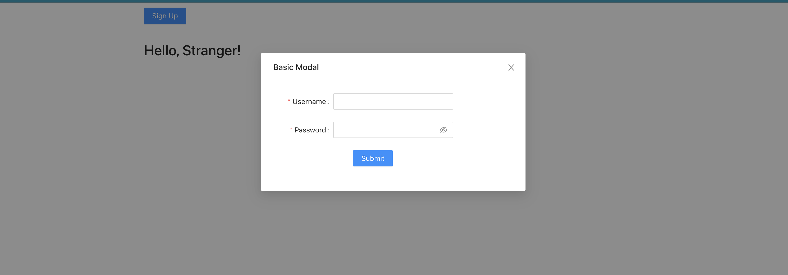
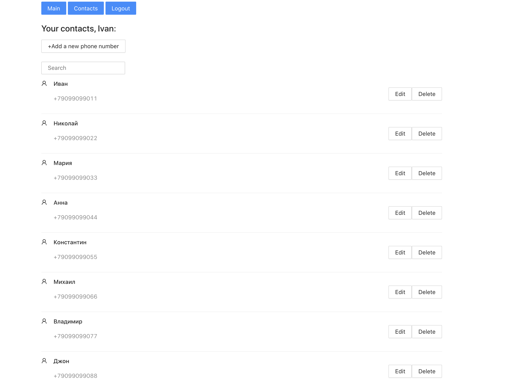
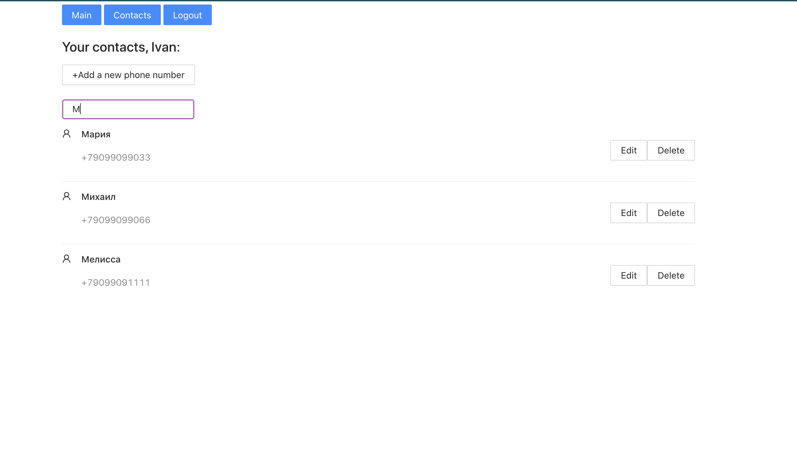

# Contact List

### `yarn`

Downloads all necessary packages

### `yarn start`

Runs the app in the development mode. 
Open [http://localhost:3000](http://localhost:3000) to view it in the browser.

## Registration 
You should sign up if yo want to use this app

## Contacts:

- You can add a contact
- You can edit a contact
- You can find a contact
- You can delete a contact

Search example:

# takeoff-test
# takeoff-test
# takeoff-test
# takeoff-test
# takeoff-test
